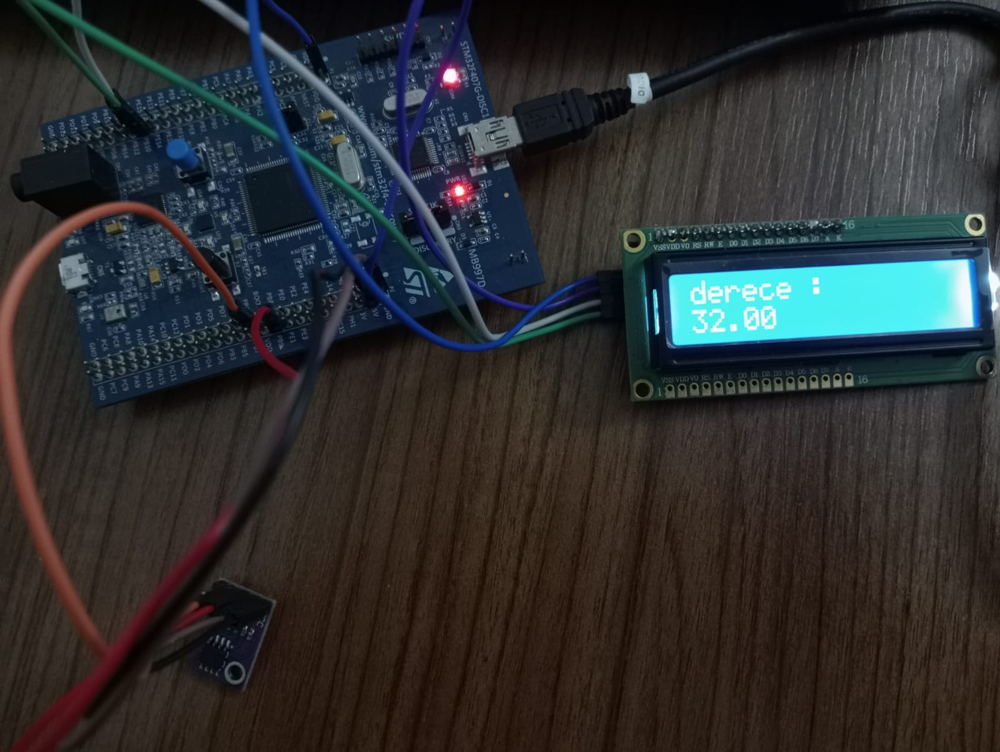

<p align="center">
  
</p>

# Smart Home IoT System Using STM32 and ASP.NET

> **Engineering Case Study**
>
> Embedded Systems • Internet of Things (IoT) • Real-Time Monitoring • Desktop Application • Database Integration • Web Technologies

---

# Executive Summary

The Smart Home IoT System is an engineering case study demonstrating the integration of embedded hardware, communication protocols, database technologies, and software applications into a unified environmental monitoring platform.

The project was developed during an industrial internship to demonstrate how sensor data can be collected by an embedded device, transmitted to software applications, stored within a relational database, and presented to end users through desktop and web interfaces.

The system utilizes an STM32F407 microcontroller together with a digital temperature sensor to perform continuous environmental monitoring. Temperature measurements are transmitted via serial communication, stored in Microsoft SQL Server, and displayed through both Windows and web-based applications.

To protect confidential business information, all organization-specific details, proprietary source code, and internal documentation have been removed. This repository focuses exclusively on the engineering methodology, system architecture, and technical implementation.

---

# Business Problem

Modern monitoring systems require reliable communication between embedded hardware and software applications to provide continuous environmental monitoring.

Manual monitoring is inefficient and does not provide historical data or real-time visibility. Organizations require integrated systems capable of collecting sensor data automatically, storing measurements, and presenting meaningful information through user-friendly software interfaces.

This project demonstrates how embedded systems and software engineering can be combined to create an end-to-end IoT monitoring solution.

---

# Project Objectives

The primary objectives of this project were to:

- Design an embedded monitoring system using STM32F407.
- Acquire environmental temperature through a digital sensor.
- Display measurements locally using an LCD module.
- Transfer sensor data to a desktop application.
- Store measurements within Microsoft SQL Server.
- Develop a Windows desktop monitoring application.
- Develop a web application for remote monitoring.
- Demonstrate an integrated IoT architecture.

---

# My Role

Throughout this project I actively participated in both embedded hardware and software development.

My responsibilities included:

- Developing embedded firmware using STM32CubeIDE
- Configuring I²C communication
- Implementing UART communication
- Integrating the LM75BD temperature sensor
- Developing the desktop monitoring application
- Designing the SQL Server database
- Developing user authentication
- Building the ASP.NET web interface
- Performing system integration and testing
- Preparing technical documentation

---

# System Architecture

```text
                    ┌─────────────────────┐
                    │ LM75BD Temperature  │
                    │      Sensor         │
                    └──────────┬──────────┘
                               │
                           I²C Bus
                               │
                               ▼
                    ┌─────────────────────┐
                    │ STM32F407 Discovery │
                    │ Embedded Controller │
                    └───────┬─────┬───────┘
                            │     │
                        LCD Display UART
                            │     │
                            ▼     ▼
                    ┌──────────────┐
                    │ USB-TTL Bridge│
                    └──────┬────────┘
                           ▼
                ┌────────────────────────┐
                │ C# WinForms Application│
                └──────────┬─────────────┘
                           ▼
                ┌────────────────────────┐
                │ Microsoft SQL Server   │
                └──────────┬─────────────┘
                           ▼
                ┌────────────────────────┐
                │ ASP.NET Web Application│
                └──────────┬─────────────┘
                           ▼
                     End User
```

---

# Engineering Workflow

```text
Requirements Analysis
        │
        ▼
Hardware Design
        │
        ▼
Embedded Software Development
        │
        ▼
Communication Integration
        │
        ▼
Desktop Application Development
        │
        ▼
Database Design
        │
        ▼
Web Application Development
        │
        ▼
System Integration
        │
        ▼
Testing & Validation
        │
        ▼
Technical Documentation
```

---

# Technical Stack

| Category | Technology |
|-----------|------------|
| Programming Language | C |
| Embedded Platform | STM32F407 Discovery |
| Development Environment | STM32CubeIDE |
| Sensor | LM75BD |
| Communication | I²C, UART |
| Display | 16×2 I²C LCD |
| Desktop Application | C# WinForms |
| Database | Microsoft SQL Server |
| Web Application | ASP.NET |
| Version Control | Git |
| Documentation | Markdown |

---

# Technical Implementation

The embedded platform was developed using the STM32F407 Discovery board and the STM32 HAL Library.

Temperature measurements were acquired through the LM75BD digital sensor using I²C communication and displayed locally on a 16×2 LCD module.

UART communication enabled continuous data transmission between the embedded device and the desktop application through a USB-to-TTL converter.

A Windows desktop application developed in C# received temperature measurements, displayed real-time data, authenticated users, and communicated with the SQL Server database.

Environmental measurements and user information were stored in Microsoft SQL Server, providing persistent storage and historical monitoring.

An ASP.NET web application was developed to provide remote access to monitoring information through a browser-based interface.

Finally, all hardware and software components were integrated and tested to validate reliable end-to-end communication.

---
# Hardware Setup

The following images show the physical prototype developed during the project.

## STM32 Development Board

<p align="center">

</p>

---

## Complete Hardware Prototype

<p align="center">

</p>

---

## Real-Time LCD Output

<p align="center">

</p>
The embedded system was developed and tested using an STM32F407 Discovery Board, an LM75BD digital temperature sensor, and a 16x2 I²C LCD display. Temperature measurements were transmitted to the desktop application via UART communication and stored in Microsoft SQL Server for historical analysis.
---

# Key Features

- Real-time temperature monitoring
- Embedded data acquisition
- LM75BD sensor integration
- I²C communication
- UART serial communication
- LCD visualization
- C# desktop monitoring application
- Microsoft SQL Server integration
- ASP.NET web application
- User authentication
- Historical temperature recording
- Modular IoT architecture

---

# Project Outcomes

The project successfully demonstrated the integration of embedded systems and software technologies within a complete IoT monitoring platform.

Major outcomes include:

- Embedded firmware implementation
- Reliable sensor communication
- Stable UART data transfer
- SQL Server database integration
- Desktop monitoring application
- Web-based monitoring interface
- End-to-end system integration
- Comprehensive technical documentation

---

# Skills Demonstrated

- Embedded Systems
- Internet of Things (IoT)
- STM32 Development
- Hardware Integration
- Sensor Integration
- I²C Communication
- UART Communication
- SQL Database Design
- Desktop Application Development
- ASP.NET Development
- System Integration
- Technical Documentation
- Problem Solving
- Analytical Thinking

---

# Challenges

The project required the integration of multiple hardware and software components into a reliable monitoring platform.

Particular attention was given to communication reliability, database connectivity, and synchronization between embedded hardware and software applications.

The experience strengthened both embedded programming skills and software engineering practices while demonstrating the importance of modular system design.

---

# Lessons Learned

This project significantly improved my understanding of embedded systems, serial communication, database integration, and IoT system architecture.

It also enhanced my experience in system integration, technical documentation, software development, and engineering problem solving.

---

# Confidentiality Statement

This repository has been intentionally anonymized.

The following information has been excluded:

- Company identity
- Original source code developed for internal use
- Network configuration
- Internal documentation
- Sensitive database information
- Proprietary implementation details
- Organization-specific screenshots

The purpose of this repository is to demonstrate the engineering methodology, software architecture, and technical competencies developed during the project without disclosing confidential business information.

---


# Repository Structure

```text
📦 stm32-smart-home-system
│
├── images/
├── firmware/
├── desktop-app/
├── database/
├── web/
├── diagrams/
├── docs/
└── README.md
```

---

## License

This repository is shared for educational and portfolio purposes only. Confidential and proprietary information has been removed in accordance with professional and ethical standards.
